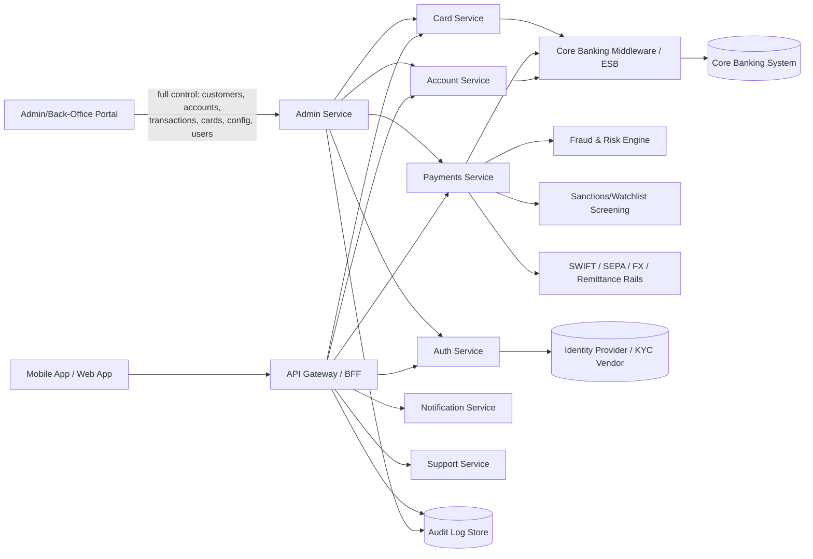

# Migros-Private Banking — E-Banking Platform PRD & TRD

**Bank Name:** Migros-Private Banking
**Document Type:** Product Requirements Document (PRD) + Technical Requirements Document (TRD)
**Product:** Internet / Mobile Banking Application
**Version:** 1.0 (Draft)
**Date:** September 27, 2026

**Companion documents:**
- [`ui-ux-design.md`](./ui-ux-design.md) — UI/UX design system, information architecture, key screens, and user flows.
- [`development-process.md`](./development-process.md) — Full SDLC, team structure, environments, CI/CD, testing strategy, and release/support process.

---

# PART 1: PRODUCT REQUIREMENTS DOCUMENT (PRD)

## 1. Purpose
This document defines the product requirements for Migros-Private Banking's secure, scalable internet and mobile banking platform that allows retail (and optionally SME) customers to manage accounts, move money, and interact with their bank digitally, 24/7.

## 2. Background & Problem Statement
Customers expect banking to be as easy as any consumer app: instant account visibility, fast transfers, biometric login, and proactive alerts. Legacy branch-dependent processes increase cost-to-serve and reduce customer retention. This product replaces/extends legacy channels with a modern, API-driven digital banking experience.

## 3. Goals & Objectives
- Enable customers to perform 90%+ of routine banking tasks without visiting a branch or calling support.
- Reduce average transaction time (e.g., fund transfer) to under 30 seconds.
- Achieve WCAG 2.1 AA accessibility compliance.
- Maintain 99.9% platform uptime.
- Reduce fraud losses via real-time risk scoring and step-up authentication.

## 4. Target Users / Personas
| Persona | Description | Key Needs |
|---|---|---|
| Retail Customer | Individual account holder | Balance checks, transfers, bill pay, statements |
| SME Owner | Small business banking client | Multi-user access, bulk payments, invoicing |
| Premium/Wealth Customer | High-net-worth client | Investment view, dedicated support, higher limits |
| Bank Ops/Support Agent | Internal staff | Case management, customer verification tools |
| Compliance Officer | Internal staff | Audit trails, AML alerts, reporting |

## 5. Scope

**Base/Main Currency:** Swiss Franc (CHF) is the platform's primary operating currency for account balances, statements, and default display; all other currencies are supported as secondary/transaction currencies (see International Transfers, §6.4).

### 5.1 In Scope (Phase 1)
- Customer onboarding (digital KYC) and login (password + biometric + MFA)
- Account dashboard (checking, savings, cards, loans overview)
- Internal transfers (own accounts) and external transfers (domestic, same-bank/other-bank)
- Bill payments and scheduled/recurring payments
- Card management (view, freeze/unfreeze, set limits, report lost/stolen)
- Transaction history, search, filtering, e-statements (PDF)
- Push/SMS/email notifications and alerts
- In-app support (chat/ticket) and FAQ/help center
- Profile & security settings (change PIN/password, manage devices, 2FA)

### 5.2 Out of Scope (Phase 1 — future phases)
- Investment/brokerage trading
- Loan origination workflows
- Open banking / third-party API marketplace (PSD2-style)
- Chatbot/AI virtual assistant

## 6. Functional Requirements

### 6.1 Onboarding & Authentication

**A. Sign-Up (Registration) Flow**
- FR-1: User can register using government ID, selfie liveness check, and existing account/customer number (digital KYC), via the following step-by-step flow:
  1. **Entry point** — customer taps "Open an account" / "Register."
  2. **Account type selection** — customer selects the product(s) to open: Retail Current/Checking, Savings, SME/Business, Junior/Family (FR-89), Multi-Currency Sub-Account (FR-42), or Encrypted Banking (FR-13m, subject to its own eligibility flow); customer may select more than one product to open together. Selection drives which downstream fields/limits/eligibility checks apply (e.g., qualified-investor check only if a wealth product is also selected).
  3. **Personal details** — name, date of birth, nationality, residential address, contact details (email, phone).
  4. **Identity document capture** — front/back scan of government ID (passport, national ID, or residence permit), with automated document-authenticity checks (hologram/MRZ validation).
  5. **Liveness/selfie verification** — real-time selfie capture matched against the ID photo via face-match + liveness detection (anti-spoofing: blink/head-turn prompts or passive liveness).
  6. **Contact verification** — OTP sent to phone/email, entered to confirm ownership.
  7. **Existing-customer linking** (if applicable) — customer enters an existing account/customer number to link the new digital profile to an existing relationship.
  8. **KYC/AML screening** — automated sanctions/PEP/watchlist screening and risk scoring run in the background; low-risk applications auto-approved, medium/high-risk routed to manual compliance review.
  9. **Terms & consent** — customer reviews and accepts terms of service, privacy policy, and e-statement consent (plus product-specific terms for any selected product, e.g., savings-goal terms, family-account parental-control terms).
  10. **Initial deposit (funding)** — customer optionally (or mandatorily, if the selected product requires a minimum opening balance) funds the new account: via linked external bank transfer/card, via Binance/crypto deposit (FR-13s–13t, subject to its own limits/screening), or by choosing "fund later" to activate the account with a zero balance. Minimum opening balance, if any, is shown per selected product before confirmation.
  11. **Credential setup** — customer sets a password and enrolls at least one biometric method (Face/Touch ID) or a passkey (FIDO2/WebAuthn); MFA method (authenticator app/SMS) is registered.
  12. **Account provisioning** — on approval, the core system provisions the account(s) selected in step 2 (with auto-generated account number/IBAN per TRD §3.6a for standard accounts, or immediately for Encrypted Banking per FR-13n1); any initial deposit from step 10 is processed and credited once the account is active; welcome notification sent.
- FR-1a: Application status tracking — customer can see registration/application progress (submitted, under review, approved, rejected, additional info required) in-app or via a status-check link before full login is available.
- FR-1b: Save-and-resume — an incomplete registration can be resumed later (time-limited, e.g., 7 days) without re-entering already-captured data.
- FR-1c: **Account type selection details** — the account-type picker shows a short description, key features, currency options, and any minimum-balance/eligibility requirement for each product, and allows changing the selection before step 8 (KYC/AML screening) without restarting the flow.
- FR-1d: **Initial deposit details** — the deposit step shows supported funding methods (external transfer, card, crypto), estimated time-to-credit per method, and clearly marks the account as "pending funding" if the customer chooses "fund later"; a follow-up reminder notification is sent if the account remains unfunded after a configurable period.

**B. Login Flow**
- FR-2: User can log in via username/password, biometric (Face/Touch ID), device PIN, or passkey (FR-54), via the following flow:
  1. **Identifier entry** — username, customer number, or registered email/phone.
  2. **Primary factor** — password entry, OR biometric prompt (Face/Touch ID via secure enclave), OR device PIN, OR passkey assertion (WebAuthn), depending on what the device/user has enrolled.
  3. **Risk assessment** — device fingerprint, geolocation, and behavioral signals scored in real time; a recognized device/location may skip step 4, an unrecognized one triggers it.
  4. **Step-up MFA (conditional)** — OTP (SMS/email/authenticator app) or biometric re-confirmation requested for new devices, unusual locations, or after a configurable inactivity period.
  5. **Session issuance** — short-lived access token + refresh token issued on success; session bound to device fingerprint.
  6. **Post-login checks** — forced actions if applicable (e.g., mandatory password reset if compromised-credential list match, terms re-acceptance if updated).
- FR-2a: "Remember this device" option to reduce step-up MFA frequency on trusted devices, with an admin/customer-configurable trust duration.
- FR-2b: Login attempt and session history visible to the customer (date, device, approximate location) for self-monitoring.

**C. Account Recovery & Credential Reset**
- FR-3: System enforces MFA (OTP via SMS/email/authenticator app) for login and high-risk transactions.
- FR-4: Account lockout after N failed attempts, with self-service unlock via verified channel (OTP to registered phone/email, or step-up to biometric/liveness re-check for higher-risk unlocks).
- FR-4a: **Forgot password** — self-service reset via OTP to registered phone/email; if the device is also unrecognized, an additional liveness re-check is required before a new password can be set.
- FR-4b: **Forgot username/customer number** — retrieval via verified email/phone, without revealing the value in the UI until identity is confirmed.
- FR-4c: **Lost/replaced device** — customer can de-register lost biometric/passkey credentials and re-enroll new ones after identity re-verification (OTP + liveness check).

### 6.2 Account Management
- FR-5: Display real-time balances across all linked accounts.
- FR-6: View detailed transaction history with filters (date range, amount, category, merchant).
- FR-7: Download/e-mail statements in PDF format for a selected period.

### 6.3 Payments & Transfers
- FR-8: Transfer funds between own accounts instantly.
- FR-9: Transfer to other bank customers (same bank) and external bank accounts (via clearing network).
- FR-10: Schedule one-time future-dated or recurring transfers.
- FR-11: Pay registered billers (utilities, telecom, credit card) with saved payee list.
- FR-12: Require step-up authentication (OTP/biometric) for transfers above a configurable threshold.
- FR-13: Show transfer status (pending, processing, completed, failed) with reference/tracking ID.

### 6.4 International Transfers
- FR-13a: **SWIFT wire transfer** — send funds abroad using beneficiary bank SWIFT/BIC code, IBAN/account number, correspondent bank details; support charge options (OUR/SHA/BEN).
- FR-13b: **SEPA transfer** — for Euro-zone beneficiaries, using IBAN, same-day/standard SEPA Credit Transfer and SEPA Instant.
- FR-13c: **Multi-currency FX transfer** — real-time or indicative FX rate quote, currency conversion, and locked-rate confirmation before send.
- FR-13d: **Correspondent/intermediary bank routing** — allow entry of intermediary bank details when required by destination country.
- FR-13e: **Remittance/money-transfer network payout** — cash pickup or wallet payout via partnered remittance networks (e.g., for corridors without direct SWIFT reach).
- FR-13f: **International bill/invoice payment** — pay overseas billers/suppliers with structured reference/invoice numbers.
- FR-13g: Beneficiary management — save, verify, and label international beneficiaries (bank name, SWIFT/BIC, IBAN/account number, address, currency).
- FR-13h: Transfer purpose/reason code capture (required for AML/regulatory reporting on cross-border payments).
- FR-13i: Fee transparency — show all fees (sending bank, correspondent, FX margin) before confirmation.
- FR-13j: Extended processing-time messaging and status tracking (e.g., "in transit," "at correspondent bank," "delivered") with estimated arrival date.
- FR-13k: Sanctions/watchlist screening triggered automatically on every international transfer before submission.
- FR-13l: Step-up authentication (MFA) mandatory for all international/cross-border transfers regardless of amount.

### 6.5 Encrypted Banking (Enhanced-Privacy Account Tier)
- FR-13m: Any customer can self-service **apply for Encrypted Banking** from their profile/settings — an opt-in, enhanced-privacy account tier.
- FR-13n: Application uses **face verification only** (biometric liveness/selfie match against the customer's existing profile photo or a fresh liveness capture) — **no additional document upload** is required for Encrypted Banking activation. Approval may be instant (on successful face match) or routed to manual review if the match confidence score is below threshold.
- FR-13n1: On approval, the system **auto-generates**: an encrypted account display name (system-generated alias, not the customer's legal name, shown in-app and on statements), a new account number, and a valid IBAN (using the bank's IBAN structure/check-digit algorithm) — all issued instantly without manual entry.
- FR-13n2: All other account details (e.g., branch/sort code, relationship manager assignment, currency sub-accounts, specific product terms) are **entered/provided by an admin** post-activation via the Admin Portal (§6.10), not by the customer.
- FR-13n3: **Compliance flag (for stakeholder review):** face-only verification, without underlying government-ID document verification, falls short of standard KYC/AML identity-verification requirements in most jurisdictions for opening a bank account. This should be validated with Legal/Compliance before build — likely mitigations: (a) require the customer to already be a fully-KYC'd existing customer (face match against an already-verified profile, not a net-new identity), and/or (b) apply this flow only up to a low balance/transaction-limit "tier" that regulatory guidance permits with simplified due diligence, with full document-based KYC required to lift limits.
- FR-13o: Once active, all of the customer's data at rest (profile, transaction history, statements, messages) is protected with dedicated per-customer encryption keys (client-side/end-to-end encryption where feasible), separate from the platform's standard shared encryption scheme.
- FR-13p: Encrypted Banking customers get: masked transaction descriptions in notifications, stricter default transfer limits, mandatory hardware-key or biometric MFA (no SMS OTP fallback), and enhanced login anomaly monitoring.
- FR-13q: Customer can view Encrypted Banking status and downgrade/opt out at any time (with appropriate re-verification), subject to regulatory record-keeping requirements (encryption cannot bypass mandatory audit/AML retention).
- FR-13r: Admin (per §6.10, RBAC-gated, maker-checker) can view Encrypted Banking application status and approve/reject applications, but cannot access the customer's per-customer encryption keys directly — only authorized under documented legal/regulatory process (e.g., court order), logged and requiring dual approval.

### 6.6 Crypto Exchange Funding (Binance Deposit)
- FR-13s: Customer can **link a Binance account** (via Binance API key/OAuth, read/withdraw-scoped only — never trade/full-access scope) from their profile settings.
- FR-13t: Customer can **initiate a deposit from Binance** to fund their bank account, in one of two supported modes:
  - **Crypto → fiat conversion**: customer selects a supported asset/amount on Binance; platform triggers Binance's sell/convert + fiat withdrawal (where Binance supports the relevant fiat rail), landing as a normal fiat deposit into the customer's bank account.
  - **Direct on-chain deposit**: platform generates a deposit address (via custodial wallet infrastructure) for supported assets (e.g., BTC, ETH, USDT); once confirmed on-chain, the platform converts to fiat at prevailing rate and credits the account.
- FR-13u: Every crypto-funded deposit is passed through **source-of-funds and blockchain-analytics screening** (e.g., address risk scoring, sanctioned-wallet checks) before funds are credited/available for use.
- FR-13v: Deposit status tracking (pending confirmation → converting → credited) with expected on-chain confirmation count and estimated credit time shown to the customer.
- FR-13w: Configurable per-customer and platform-wide daily/monthly crypto-deposit limits (admin-configurable, §6.10).
- FR-13x: **Compliance flag (for stakeholder review):** accepting crypto-sourced deposits generally brings the bank in scope as (or as a partner to) a Virtual Asset Service Provider (VASP), triggering Travel Rule data-sharing requirements (originator/beneficiary information exchange with Binance as a VASP counterparty), enhanced due diligence on crypto source of funds, and jurisdiction-specific licensing considerations. This must be reviewed with Legal/Compliance before build — likely mitigations: (a) restrict to fiat off-ramp via Binance's own regulated withdrawal rails only (avoiding direct on-chain custody), and/or (b) cap crypto-funded deposits to a conservative limit pending full VASP compliance review.

### 6.7 Card Services
- FR-14: View linked debit/credit cards, masked card numbers, and expiry.
- FR-15: Freeze/unfreeze card instantly.
- FR-16: Set/adjust spending limits and channel controls (online, ATM, international).
- FR-17: Report card lost/stolen and request replacement.

### 6.8 Notifications
- FR-18: Push/SMS/email alerts for transactions, low balance, login from new device, failed login attempts.
- FR-19: User-configurable notification preferences per channel and event type.

### 6.9 Support
- FR-20: In-app secure messaging/chat with support, with ticket history.
- FR-21: FAQ/help center searchable by keyword.

### 6.10 Administration (Back Office / Admin Portal — full control)
The admin portal gives authorized bank staff full operational control of the platform, gated by role-based permissions and fully audit-logged. All admin actions require re-authentication (step-up MFA) and are immutable in the audit log.

**Customer & Account Control**
- FR-22: View, create, edit, suspend, or close any customer profile and account.
- FR-23: Manually adjust account status (freeze/unfreeze, block/unblock), override limits, and force logout of active sessions.
- FR-24: Reset customer credentials, MFA devices, and biometric registrations on verified request.

**Transaction Control**
- FR-25: View, search, and filter all transactions system-wide (not just per-customer).
- FR-26: Approve, hold, reverse, or cancel pending transactions (including international transfers) within policy limits.
- FR-27: Override/release transactions flagged by the fraud/risk engine, with mandatory justification note.
- FR-27a: **Directly edit transaction records** — admin can modify a transaction's fields (amount, currency, date/timestamp, type/category, description/reference, status) after creation, for correction or support purposes, not only reverse/cancel/hold it. Every direct edit captures before/after values, a mandatory justification note, and requires maker-checker dual approval before the change is applied (per FR-77–78), and is fully visible in the audit trail (FR-37).

**Card Control**
- FR-28: Issue, block, unblock, or cancel any customer card; adjust limits and channel controls on behalf of a customer.

**Product & Configuration Control**
- FR-29: Configure transaction limits (daily/per-transaction, domestic and international) globally, per segment, or per customer.
- FR-30: Configure FX rates/margins, fee schedules, and available currencies/corridors for international transfers.
- FR-31: Manage the biller directory (add/edit/remove billers), payment rails, and supported transfer types.
- FR-32: Manage notification templates and system-wide announcements/maintenance banners.

**User & Role Management**
- FR-33: Create and manage internal admin/ops/compliance user accounts with granular role-based access control (RBAC).
- FR-34: Define custom roles and permission sets (e.g., read-only auditor, transaction approver, super-admin).

**Compliance & Monitoring**
- FR-35: Review and action AML/sanctions alerts, including cross-border transfer screening results.
- FR-36: Generate regulatory reports (SAR/CTR-style, transaction volume, KYC status) on demand or on schedule.
- FR-37: Full audit trail viewer — search all admin and customer actions by user, date, action type, or entity.

**Dashboards & Oversight**
- FR-38: Real-time operational dashboard (transaction volumes, system health, fraud alerts, failed logins).
- FR-39: Export data (transactions, customers, audit logs) for offline analysis, respecting data-privacy controls.

**Universal Edit Access**
- FR-76: Admin can **view and edit every data field and record across every module of the platform** — not limited to the areas listed above. This explicitly includes modules added later in this document: Encrypted Banking applications/status (FR-13r), international transfer records and beneficiary details, crypto/Binance deposit records and limits (FR-13w), savings goals/budgets, standing orders and direct-debit mandates, virtual/physical card configurations, wealth/investment advisory notes (FR-72), estate-planning cases (FR-73), trust/foundation applications (FR-74), loyalty/rewards balances, transaction-type reference data (§6.12), and deposit-protection/FATCA-CRS flags (FR-71, FR-75).
- FR-77: Any edit made by an admin to customer-facing or financial data is versioned (before/after values captured) and requires a mandatory justification note, feeding the audit trail (FR-37) — this applies uniformly across all modules in FR-76, not only the transaction/customer edits already listed above.
- FR-78: Edits to regulated or high-sensitivity fields (KYC status, balances, IBAN/account numbers, encryption-tier status, trust/foundation structures) additionally require maker-checker dual approval before taking effect, consistent with the Control Principle below.

| Module | Admin Edit Scope |
|---|---|
| Customers & Accounts | Full CRUD (FR-22–24, FR-76) |
| Transactions (all types, §6.12) | Full CRUD — view, hold, reverse, cancel, and **directly edit any field** (amount, date, type, status, reference) with before/after logging (FR-25–27, FR-27a, FR-32) |
| International Transfers | View, hold, edit beneficiary/routing data, cancel/reverse pending transfers |
| Encrypted Banking | View application status, approve/reject, edit tier settings/limits (not raw encryption keys — legal-process only) |
| Crypto/Binance Deposits | View, edit limits, flag/reverse suspicious deposits |
| Cards | Full CRUD incl. virtual card issuance, limits, MCC controls (FR-28) |
| Savings, Budgets, Standing Orders, Direct Debits | Full CRUD on behalf of a customer for support/correction purposes |
| Wealth / Advisory / Estate / Trust | Full CRUD on case records, notes, and structure setup (FR-72–74) |
| Loyalty & Rewards | Adjust/credit/debit balances, edit redemption rules |
| Configuration (limits, FX margins, fees, billers, transfer corridors, transaction-type reference data) | Full CRUD (FR-29–31) |
| Notifications & Content | Full CRUD on templates, banners, market-insight feed content (FR-32) |
| Users, Roles & Permissions | Full CRUD, including defining new roles (FR-33–34) |
| Compliance (AML, sanctions, FATCA/CRS, deposit-protection flags) | Full CRUD on records and review actions (FR-35–36, FR-71, FR-75) |
| Audit Log | Read-only by design — never editable, even by super-admin |

> **Control principle:** "Full control" is implemented as *comprehensive coverage of admin functions across every module*, not unrestricted, untracked access for any single admin — every capability above is scoped by RBAC, requires a justification note and, for regulated/high-sensitivity fields, maker-checker dual approval, and is logged immutably (with before/after values) to satisfy audit and regulatory requirements. The one deliberate exception is the audit log itself, which remains permanently read-only to preserve its integrity as evidence.

### 6.11 Extended Feature Set

**A. Accounts & Money Management**
- FR-40: Savings goals/pots — customer creates named goals with target amount/date; supports auto-save rules (fixed schedule) and round-up savings (round up transactions to nearest unit, transfer difference to goal).
- FR-41: Budgeting tools — auto-categorization of transactions (merchant/category tagging) with monthly spend insights and category-level budgets/alerts.
- FR-42: Multi-currency wallets/sub-accounts — customer can hold balances in CHF, USD, EUR, GBP, etc. as separate sub-accounts under one profile, with in-app conversion between them.
- FR-43: Joint/shared accounts — multiple customers linked to one account with configurable permission levels (view-only, transact, admin).
- FR-44: Standing order management — single screen to view, edit, pause, or cancel all recurring/scheduled payments.

**B. Payments**
- FR-45: QR-code instant P2P payment (Twint-style) — send/receive money via QR code or mobile number, near-instant settlement.
- FR-46: Split-bill / request-money — customer can request a specific amount from another user (in-app or via shareable link), who pays back with one tap.
- FR-47: Direct debit / e-bill (LSV) management — view, authorize, or revoke direct-debit mandates and e-bills from registered billers.
- FR-48: Scheduled batch/bulk payments — SME customers can upload/submit a batch (e.g., payroll file) for same-day or scheduled processing.
- FR-49: Payment templates/favorites — save frequent payees/amounts as one-tap templates.

**C. Cards**
- FR-50: Instant virtual card issuance — new customer or replacement card gets a usable virtual card (for online/mobile-wallet use) immediately, ahead of physical card delivery.
- FR-51: Mobile wallet provisioning — push card directly to Apple Pay / Google Pay / Samsung Pay from within the app.
- FR-52: Merchant-category controls — customer (or admin, per policy) can block/allow spending by merchant category (e.g., gambling, adult content, crypto exchanges).
- FR-53: Real-time card transaction notifications — push alert on every card transaction with merchant name, logo, amount, and location.

**D. Security & Identity**
- FR-54: Passkey (FIDO2/WebAuthn) passwordless login, in addition to password + biometric.
- FR-55: Device/session management — customer can view all active sessions/devices and remotely log out any or all of them.
- FR-56: Configurable "cooling-off" period for new/unverified payees (e.g., transfer limits reduced for first 24–48 hours after adding a new payee) to reduce fraud exposure.
- FR-57: Voice biometric verification as an additional authentication factor for phone/call-center support interactions.

**E. Wealth / Private Banking**
- FR-58: Portfolio/investment overview — read-only feed of holdings, performance, and valuation from the bank's asset-management/wealth platform.
- FR-59: Relationship manager (RM) booking — schedule chat, phone, or video calls with an assigned RM directly from the app.
- FR-60: Secure document vault — customer storage for statements, tax documents, contracts, and RM-shared documents, encrypted at rest.
- FR-61: Personalized market insights/newsletter feed, curated per customer segment or portfolio composition.
- FR-72: **Investment advisory** — customer can request/receive tailored investment recommendations from an assigned advisor (or, in a later phase, a robo-advisory engine); advisory notes and proposals stored against the customer's profile and viewable in-app.
- FR-73: **Estate planning services** — customer can initiate an estate/succession-planning request (e.g., will registration, beneficiary designation on accounts, inheritance-planning consultation booking); RM/estate-planning specialist assigned and tracked as a case.
- FR-74: **Trust & foundation services** — customer (typically premium/private-banking tier) can apply for trust or foundation account structures; application routed to a specialist team for setup, with the resulting trust/foundation entity linked to the customer's relationship in the core system for reporting and compliance purposes.

**F. Engagement & Personalization**
- FR-62: Dark mode / light mode theming.
- FR-63: Customizable dashboard — customer can reorder/hide dashboard widgets (accounts, spending insights, quick actions).
- FR-64: Mid-session language switch without requiring re-login.
- FR-65: Loyalty/rewards integration — link and display Migros Cumulus-style points/rewards balance, with redemption options relevant to banking (e.g., fee waivers, cashback).

**G. Admin/Ops Additions**
- FR-66: Customer segmentation — admin can define segments (by product, balance tier, behavior) for targeted in-app messaging/offers.
- FR-67: A/B testing framework — admin can configure and run experiments on in-app offers, messaging, or UI variants, with results dashboard.
- FR-68: Bulk import/export tooling — admin can bulk-import/migrate customer and account data (with validation reports) and export data sets for analysis.
- FR-69: Scheduled maintenance mode — admin can schedule downtime windows with a customer-facing banner/notification shown in advance and during the window.

**H. Compliance / Reporting**
- FR-70: Tax reporting exports — generate Swiss tax statement (Steuerauszug)-style annual account/asset summaries per customer, downloadable as PDF.
- FR-71: FATCA/CRS reporting flags — capture and flag customer tax-residency status on profile, feeding into regulatory reporting extracts.
- FR-75: **Deposit protection disclosure** — display esisuisse deposit-protection coverage status/limit (currently CHF 100,000 per customer per bank) on account-opening screens, account details, and terms documentation.

**I. Wealth / Private Banking — Extended**
- FR-79: **Precious metal trading & safe custody** — customer can buy/sell gold, silver, and other precious metals via allocated or unallocated accounts, with optional physical safekeeping in the bank's vault; holdings shown alongside other portfolio assets.
- FR-80: **Structured products & alternative investments** — qualified/eligible customers can view and subscribe to structured notes, hedge funds, or private equity offerings, with eligibility checks (qualified-investor status) enforced before access.
- FR-81: **Currency hedging** — customer can request FX forward or option contracts to hedge currency exposure, processed via RM/treasury desk with rate confirmation shown in-app.
- FR-82: **Family office / multi-generational wealth transfer planning** — customer can initiate a wealth-transfer/succession planning engagement, tracked as a case with the assigned specialist team (extends FR-73 estate planning).
- FR-83: **Philanthropy & donation advisory** — customer can request advisory support for charitable giving, including donor-advised fund setup, tracked as a case with a specialist advisor.
- FR-84: **ESG / sustainable investing options** — customer can filter/select ESG-screened portfolios or funds, with sustainability metrics/reporting shown alongside standard performance data.

**J. Lending & Insurance**
- FR-85: **Mortgage/loan calculator** — self-service, no-login-required estimate tool (amount, term, indicative rate, monthly payment) accessible from the app or public site.
- FR-86: **Loan/mortgage application** — customer can submit a mortgage or personal loan application in-app, upload supporting documents, and track application status through underwriting stages.
- FR-87: **Bancassurance** — customer can browse, purchase, and manage insurance products (life, travel, property/home) offered in partnership with an insurance provider, with policies visible alongside banking products.
- FR-88: **Credit score view** — customer can view their credit score/rating (sourced from a credit bureau integration, future phase per §10 Third-Party Integrations) with basic explanatory factors.

**K. Family & Lifestyle**
- FR-89: **Junior/family accounts** — parent/guardian can open and manage a linked account for a minor, with parental controls (spending limits, category restrictions, allowance/pocket-money auto-transfers, and view-only or restricted access for the minor via their own login).
- FR-90: **Safe deposit box booking** — customer can view available safe deposit boxes at a branch, reserve/rent one, and book access appointments in-app.
- FR-91: **Referral program** — customer can generate and share a referral link/code; both referrer and referee reward status tracked and credited (e.g., via Loyalty Integration Service, FR-65).

**L. Support & Dispute**
- FR-92: **Self-service transaction dispute/chargeback filing** — customer can flag a specific transaction as disputed/unrecognized directly from transaction history, submit supporting details, and track dispute case status through resolution.
- FR-93: **Dark-web identity monitoring** — customer can opt in to monitoring of their email/personal identifiers against known data-breach/dark-web sources, with proactive alerts if a match is found.

### 6.12 Transaction Type List
The platform must classify, process, and display every transaction under one of the following types. This list is the canonical reference for the `Transaction.type` field (TRD §4) and drives statement categorization, notification templates, limit rules, and reporting.

| Code | Transaction Type | Direction | Category | Notes / Related FR |
|---|---|---|---|---|
| TXN-01 | Internal transfer (own accounts) | Debit/Credit | Transfers | FR-8 |
| TXN-02 | Domestic transfer — same bank | Debit/Credit | Transfers | FR-9 |
| TXN-03 | Domestic transfer — other bank (interbank) | Debit/Credit | Transfers | FR-9 |
| TXN-04 | International wire transfer (SWIFT) | Debit | International Transfers | FR-13a |
| TXN-05 | SEPA Credit Transfer | Debit | International Transfers | FR-13b |
| TXN-06 | SEPA Instant Transfer | Debit | International Transfers | FR-13b |
| TXN-07 | FX conversion transfer (cross-currency) | Debit/Credit | International Transfers | FR-13c |
| TXN-08 | Remittance / cash-pickup payout | Debit | International Transfers | FR-13e |
| TXN-09 | International bill/invoice payment | Debit | International Transfers | FR-13f |
| TXN-10 | Domestic bill payment | Debit | Payments | FR-11 |
| TXN-11 | Standing order / recurring payment execution | Debit | Payments | FR-10, FR-44 |
| TXN-12 | Direct debit / e-bill (LSV) collection | Debit | Payments | FR-47 |
| TXN-13 | QR-code / P2P instant payment | Debit/Credit | Payments | FR-45 |
| TXN-14 | Split-bill / money-request settlement | Debit/Credit | Payments | FR-46 |
| TXN-15 | Batch/bulk payment (e.g., payroll line item) | Debit | Payments (SME) | FR-48 |
| TXN-16 | Card purchase — point of sale (POS) | Debit | Card | Card Services |
| TXN-17 | Card purchase — online/e-commerce | Debit | Card | Card Services |
| TXN-18 | ATM cash withdrawal | Debit | Card | Card Services |
| TXN-19 | ATM/branch cash deposit | Credit | Card / Cash | — |
| TXN-20 | Card refund / merchant reversal | Credit | Card | — |
| TXN-21 | Card chargeback / dispute adjustment | Credit/Debit | Card | Admin-initiated |
| TXN-22 | Crypto deposit — Binance conversion (crypto→fiat) | Credit | Crypto Funding | FR-13t |
| TXN-23 | Crypto deposit — direct on-chain | Credit | Crypto Funding | FR-13t |
| TXN-24 | Savings goal contribution (manual/auto-save) | Debit/Credit | Savings | FR-40 |
| TXN-25 | Round-up savings sweep | Debit/Credit | Savings | FR-40 |
| TXN-26 | Interest credit (savings/deposit interest) | Credit | Interest | — |
| TXN-27 | Account/service fee debit (maintenance, transfer, card fee) | Debit | Fees | — |
| TXN-28 | Foreign exchange margin/fee | Debit | Fees | Related to FX transfers |
| TXN-29 | Incoming salary/payroll credit | Credit | Income | — |
| TXN-30 | General incoming credit (third-party payer) | Credit | Income | — |
| TXN-31 | Loyalty/rewards redemption (Cumulus) | Credit/Debit | Rewards | FR-65 |
| TXN-32 | Admin-initiated manual adjustment/correction | Debit/Credit | Admin | FR-26, requires justification note |
| TXN-33 | Reversal of a failed/returned transaction | Credit/Debit | System | Auto-generated |
| TXN-34 | Account closure final settlement | Debit/Credit | Admin | Admin-initiated |

> Every transaction type carries a **status** (pending, processing, completed, failed, reversed, on-hold) and, where applicable, a **hold reason** (fraud review, sanctions screening, compliance review) as defined in FR-13 and FR-26/FR-27. Admin can directly edit any transaction field post-creation per FR-27a, subject to maker-checker approval and audit logging.

## 7. Non-Functional Requirements
| Category | Requirement |
|---|---|
| Performance | 95% of API calls respond in <500ms; page load <2s on 4G |
| Availability | 99.9% uptime SLA (excl. planned maintenance) |
| Security | PCI-DSS, encryption at rest & in transit, no plaintext credential storage |
| Compliance | KYC/AML, local banking regulator requirements, data residency, GDPR/local data privacy law |
| Accessibility | WCAG 2.1 AA |
| Scalability | Support 1M+ registered users, 10K concurrent sessions at launch, horizontally scalable |
| Localization | Multi-language support (configurable); CHF as base/default currency, local currency formatting per locale |
| Auditability | Full audit trail for all financial transactions and admin actions, immutable logs |

## 8. Success Metrics (KPIs)
- Digital adoption rate (% of active customers using the app monthly)
- Average transaction completion time
- App Store / Play Store rating ≥ 4.5
- First-contact resolution rate for support tickets
- Fraud loss rate (basis points of transaction volume)
- Login success rate / biometric adoption rate

## 9. Assumptions & Constraints
- Core banking system (CBS) exposes APIs or the platform integrates via a middleware/ESB layer.
- Regulatory approval required before public launch (varies by jurisdiction).
- Existing customer data must be migrated/validated prior to go-live.
- As a Swiss bank, the platform and its operations must comply with **FINMA** regulatory requirements, and customer deposits fall under the **esisuisse** depositor-protection scheme (disclosed to customers per FR-75).

## 10. Release Roadmap (indicative)
| Phase | Scope | Target |
|---|---|---|
| Phase 0 | Discovery, compliance review, architecture sign-off | Month 1–2 |
| Phase 1 (MVP) | Onboarding, accounts, transfers, cards, notifications | Month 3–7 |
| Phase 2 | Bill pay expansion, SME features, chat support | Month 8–10 |
| Phase 3 | Open banking APIs, FX/international transfers | Month 11+ |

---

# PART 2: TECHNICAL REQUIREMENTS DOCUMENT (TRD)

## 1. Architecture Overview
A cloud-native, microservices-based architecture fronted by an API Gateway, integrating with the bank's Core Banking System (CBS) via a middleware/integration layer, with dedicated services for auth, payments, notifications, and fraud/risk.

## 2. Technology Stack (proposed)
| Layer | Technology |
|---|---|
| Mobile Apps | Kotlin (Android), Swift (iOS), or React Native/Flutter for cross-platform |
| Web App | React or Angular, TypeScript |
| API Gateway | Kong / AWS API Gateway / Apigee |
| Backend Services | Java (Spring Boot) or Node.js (NestJS), containerized |
| Messaging/Queue | Apache Kafka or RabbitMQ (async events, transaction pipelines) |
| Databases | PostgreSQL/Oracle (transactional), Redis (caching/session), MongoDB (logs/documents) |
| Core Banking Integration | REST/SOAP adapters via ESB (MuleSoft/WSO2) or direct CBS APIs |
| Identity & Auth | OAuth 2.0 / OpenID Connect, FIDO2/WebAuthn for biometrics |
| Infrastructure | Kubernetes (EKS/AKS/GKE) or on-prem private cloud (per regulatory constraints) |
| Monitoring | Prometheus/Grafana, ELK/OpenSearch, Datadog |
| CI/CD | GitLab CI / Jenkins, ArgoCD for GitOps deployment |

## 3. Core Services

### 3.1 Auth Service
- Handles registration, login, MFA, session/token management (JWT, short-lived access + refresh tokens).
- Integrates with biometric APIs (FIDO2/WebAuthn) and OTP providers.
- Device fingerprinting and risk-based authentication.
- **Sign-up sub-flow** (per PRD §6.1.A): orchestrates account-type selection (persisted against the application) → document capture → OCR/document-authenticity check (via KYC vendor) → liveness/face-match (via KYC vendor) → OTP contact verification → KYC/AML/sanctions screening call → initial-deposit capture (calls Payments Service or Crypto Funding Service to initiate the chosen funding method, or flags the application "pending funding") → credential enrollment (password hash via bcrypt/Argon2, biometric public-key registration, passkey WebAuthn registration) → triggers Account Service to provision the selected account(s) on approval and, if funded, credits the initial deposit once the account is active. Application state persisted so registration can be saved/resumed (FR-1b) within a TTL.
- **Login sub-flow** (per PRD §6.1.B): identifier lookup → primary-factor verification (password hash compare, or WebAuthn/biometric assertion verification) → risk engine call (device fingerprint + geo + behavioral score) → conditional step-up MFA (OTP or biometric re-confirmation) → token issuance (short-lived access token + refresh token, bound to device fingerprint) → login/session history event published.
- **Recovery sub-flow** (per PRD §6.1.C): forgot-password and forgot-username handled via OTP-verified self-service endpoints; unrecognized-device password resets and lost-device credential re-enrollment additionally require a liveness re-check call to the KYC vendor before completion, to prevent account-takeover via a compromised email/phone alone.
- Publishes login/registration events to Kafka for the Notification Service (new-device alerts, FR-18) and the Fraud & Risk Engine (§3.4).

### 3.2 Account Service
- Aggregates account balances/transactions from CBS via middleware.
- Caches read-heavy data (balances) with short TTL; never caches sensitive PII long-term.

### 3.3 Payments Service
- Orchestrates transfer workflows: validation → sanctions/watchlist screening → risk check → CBS posting → confirmation.
- Idempotency keys on all transaction requests to prevent duplicate processing.
- Integrates with national payment/clearing rails (e.g., ACH/RTGS/instant payment schemes as applicable) for domestic transfers.
- **International transfer rails:**
  - **SWIFT network** (MT103/MX pacs.008 messaging) for wire transfers, via a SWIFT service bureau or direct SWIFT Alliance Access connection.
  - **SEPA Credit Transfer / SEPA Instant** connectivity for Euro-zone payments (via a licensed SEPA participant/PSP).
  - **FX rate provider integration** for real-time/indicative quotes and rate-lock on cross-currency transfers. CHF is the platform's base/ledger currency; all FX conversions are calculated against CHF as the reference currency.
  - **Correspondent banking routing logic** to resolve intermediary banks when no direct relationship exists.
  - **Remittance network APIs** (partner integration) for cash-pickup/wallet payout corridors.
  - **Sanctions/watchlist screening service** (OFAC, UN, EU lists, PEP screening) invoked synchronously before submission of any cross-border payment.

### 3.4 Fraud & Risk Engine
- Real-time transaction scoring (rules engine + ML model) before posting high-risk transactions.
- Triggers step-up authentication or manual review based on score thresholds.

### 3.5 Notification Service
- Event-driven (consumes Kafka topics) push/SMS/email dispatch via third-party providers (Firebase, Twilio, SES).

### 3.6 Encrypted Banking Service
- Handles Encrypted Banking applications via **face verification only** (calls the biometric liveness/face-match provider used at login — no document/OCR step in this flow) and applies the resulting confidence score against an approval threshold (instant-approve vs. manual review).
- On approval, calls the **Account Number & IBAN Generator** (below) and creates the account record with a system-generated alias name; all other account attributes are left blank pending admin input via the Admin Service (§3.8).
- Manages per-customer encryption key lifecycle via KMS/HSM, issuing dedicated data-encryption keys (DEKs) wrapped by a master key; DEKs never leave the KMS boundary unencrypted.
- Enforces field-level encryption for Encrypted Banking customers' profile, transaction, and messaging data, transparent to other services via a shared crypto SDK.
- Emergency/legal-access workflow: any key-recovery or data-access request under legal process requires dual admin approval and is separately audit-logged (see §3.9).
- **Compliance dependency:** this service must be gated by a policy flag (configurable by Admin/Compliance, §3.8) restricting face-only onboarding to a defined risk tier (e.g., existing fully-KYC'd customers only, and/or capped balance & transaction limits) pending Legal/Compliance sign-off — see PRD FR-13n3.

### 3.6a Account Number & IBAN Generator
- Stateless utility invoked on Encrypted Banking approval (and available to core account-opening flows generally).
- Generates a unique internal account number per the bank's numbering scheme, with a uniqueness check against the account database before assignment.
- Constructs a valid IBAN: country code + IBAN check digits (MOD-97-10 per ISO 7064) + bank code + generated account number, validated against the ISO 13616 IBAN structure for the issuing country before persisting.
- Generates a display alias (e.g., "Encrypted Account •••• 4821") used in place of the customer's legal name on Encrypted Banking statements/notifications; legal name remains linked internally for compliance/audit purposes only.

### 3.7 Crypto Funding Service (Binance Deposit)
- Manages the linked Binance connection per customer (stores encrypted API credentials/OAuth tokens, withdraw/read-only scope enforced at the integration layer).
- **Conversion mode:** calls Binance's convert/sell + fiat-withdrawal APIs, then reconciles the incoming fiat settlement against the customer's deposit request.
- **On-chain mode:** integrates with a custodial wallet/blockchain infrastructure provider (e.g., Fireblocks, BitGo, or similar) to generate per-deposit addresses, monitor confirmations via blockchain-node/webhook, and trigger conversion to fiat at prevailing rate on confirmation.
- Calls a **blockchain analytics/address-screening provider** (e.g., Chainalysis, Elliptic-class service) on every on-chain deposit before crediting funds, blocking or flagging deposits from sanctioned/high-risk addresses.
- Publishes deposit lifecycle events (pending → confirming → converting → credited) to the customer via the Notification Service.
- Enforces configurable per-customer/platform crypto-deposit limits, sourced from the Admin Service (§3.8) configuration store.
- **Compliance dependency:** this service must be gated by a policy flag pending Legal/Compliance review of VASP/Travel-Rule obligations (see PRD FR-13x) before general availability.

### 3.8 Admin/Back-Office Service
- Dedicated internal-only service (separate deployment, network-isolated from public internet, VPN/private-network access only) exposing full administrative control over **every module** in the platform: customers, accounts, transactions (all types per PRD §6.12), international transfers, Encrypted Banking, crypto/Binance deposits, cards, savings/budgets/standing orders/direct debits, wealth/advisory/estate/trust records, loyalty & rewards, notifications/content, configuration, users/roles, and compliance records (per PRD §6.10 Universal Edit Access, FR-76–78).
- Acts as a thin orchestration/authorization layer that proxies edit calls to each domain service's own admin-write API (Account, Payments, Card, Encrypted Banking, Crypto Funding, Wealth Integration, Loyalty Integration, etc.) rather than owning that data itself — keeping each domain service as the source of truth while giving the Admin Service a single consistent RBAC/approval/audit gate in front of all of them.
- Enforces fine-grained RBAC (per FR-33/FR-34) and maker-checker approval workflows for sensitive/regulated-field edits (KYC status, balances, IBAN/account numbers, encryption-tier status, trust/foundation structures) as well as transaction reversal, limit overrides, and international transfer holds/releases (FR-77–78).
- All write actions require step-up MFA re-authentication, capture before/after field values, and generate an audit event before execution; the audit log itself is exposed only as read-only, even to super-admin roles.
- Exposes configuration APIs for limits, fee schedules, FX margins, biller directory, transfer-corridor availability, and transaction-type reference data, consumed by the relevant domain services at runtime (no code deploy needed for business-parameter changes).

### 3.9 Audit & Logging
- Every financial transaction and admin action (including who approved/overrode what, and why) written to an immutable, append-only audit log store, separate from operational databases.
- Maker-checker actions store both the requesting and approving admin identities.

## 4. Data Model (high-level entities)
- `Customer` (id, KYC status, contact info, linked accounts)
- `Account` (id, customer_id, type, balance, base_currency [default: CHF], status)
- `Transaction` (id, account_id, type [enum — see PRD §6.12 Transaction Type List, e.g. TXN-01..TXN-34], amount, currency, status [pending/processing/completed/failed/reversed/on-hold], hold_reason [fraud_review/sanctions_screening/compliance_review — nullable], timestamp, reference_id)
- `Card` (id, account_id, masked_pan, status, limits)
- `Payee` (id, customer_id, payee_details, verified_flag)
- `Device` (id, customer_id, device_fingerprint, trust_status)
- `AuditLog` (id, actor, action, entity, timestamp, metadata)

> Note: PII and cardholder data must be tokenized/encrypted at the field level; PANs stored only as tokens per PCI-DSS scope reduction.

## 5. API Design Principles
- RESTful JSON APIs (or GraphQL for BFF aggregation), versioned (`/v1/...`).
- All endpoints require OAuth2 bearer tokens; sensitive endpoints require step-up MFA claim in token.
- Rate limiting per customer/IP at the gateway.
- Sample endpoints:
  - `POST /v1/auth/register/start` (begin sign-up, returns application ID)
  - `POST /v1/auth/register/{id}/account-type` (select product(s) to open)
  - `POST /v1/auth/register/{id}/document` (ID document upload)
  - `POST /v1/auth/register/{id}/liveness` (selfie/liveness capture)
  - `POST /v1/auth/register/{id}/verify-contact` (OTP confirmation)
  - `POST /v1/auth/register/{id}/initial-deposit` (select funding method/amount, or defer)
  - `POST /v1/auth/register/{id}/credentials` (set password/biometric/passkey)
  - `GET /v1/auth/register/{id}/status`
  - `POST /v1/auth/login`
  - `POST /v1/auth/mfa/verify`
  - `POST /v1/auth/passkey/assert`
  - `POST /v1/auth/recovery/forgot-password`
  - `POST /v1/auth/recovery/forgot-username`
  - `POST /v1/auth/recovery/reenroll-device` (lost/replaced device credential re-enrollment)
  - `GET /v1/auth/sessions` / `DELETE /v1/auth/sessions/{id}` (device/session management, FR-55)
  - `GET /v1/accounts`
  - `GET /v1/accounts/{id}/transactions`
  - `POST /v1/transfers`
  - `GET /v1/transfers/{id}/status`
  - `POST /v1/cards/{id}/freeze`
  - `POST /v1/support/tickets`
  - `POST /v1/international-transfers/quote` (FX rate quote)
  - `POST /v1/international-transfers` (submit SWIFT/SEPA/remittance transfer)
  - `GET /v1/international-transfers/{id}/status`
  - `POST /v1/beneficiaries/international` (add/verify international beneficiary)
  - `POST /v1/encrypted-banking/apply`
  - `GET /v1/encrypted-banking/status`
  - `POST /v1/encrypted-banking/opt-out`
  - `POST /v1/crypto-funding/link-binance`
  - `POST /v1/crypto-funding/deposit`
  - `GET /v1/crypto-funding/deposit/{id}/status`
  - **Admin API (internal, network-isolated, separate auth realm):**
    - `GET/PATCH /admin/v1/customers/{id}`
    - `POST /admin/v1/transactions/{id}/reverse`
    - `POST /admin/v1/transactions/{id}/release` (release fraud/compliance hold)
    - `PATCH /admin/v1/transactions/{id}` (direct field-level edit — amount, date, type, status, reference; requires maker-checker approval)
    - `PATCH /admin/v1/config/limits`
    - `PATCH /admin/v1/config/fx-margins`
    - `POST /admin/v1/roles` / `POST /admin/v1/admin-users`
    - `GET /admin/v1/audit-log`
    - `PATCH /admin/v1/encrypted-accounts/{id}/details` (set branch/RM/product terms post-activation)

## 6. Security Architecture
- **Transport:** TLS 1.2+ everywhere; certificate pinning on mobile apps.
- **Data at rest:** AES-256 encryption; HSM/KMS-managed keys.
- **Authentication:** MFA mandatory; biometric via secure enclave (never stored server-side).
- **Authorization:** Role-based access control (RBAC) for customer vs. admin/ops roles; least privilege for internal staff.
- **Fraud controls:** Device binding, velocity checks, geolocation anomaly detection.
- **Secrets management:** Vault/KMS; no secrets in code or config files.
- **Penetration testing:** Required pre-launch and at least annually.

## 7. Extended Feature Services (supporting PRD §6.11)

| Feature Area | Service / Component | Key Technical Notes |
|---|---|---|
| Savings goals, round-up, budgeting | **Insights & Budgeting Service** | Consumes transaction events from Kafka; runs merchant-category classification (ML model or third-party enrichment API, e.g., Plaid-style categorization); computes round-up amounts and triggers auto-transfers via Payments Service |
| Multi-currency sub-accounts | Extends **Account Service** | Sub-account ledger entries per currency under one customer/account ID; conversion via FX rate provider (shared with International Transfers, §3.3) |
| Joint/shared accounts | Extends **Account Service** + Auth Service | Account-to-customer mapping becomes many-to-many with a permission-level attribute per link |
| Standing orders | Extends **Payments Service** | Recurring-payment scheduler (cron-style jobs or a workflow engine e.g. Temporal) with pause/cancel state machine |
| QR/P2P instant payments | **P2P Payments Service** | Integrates with national instant-payment/P2P scheme (e.g., Twint API in Switzerland); generates/reads QR payloads per scheme spec |
| Split-bill / request-money | Extends **P2P Payments Service** | Request objects with shareable deep link; notification-driven acceptance flow |
| Direct debit / e-bill (LSV) | **Direct Debit Service** | Integrates with national e-bill/LSV infrastructure; mandate lifecycle (create/authorize/revoke) stored with audit trail |
| Batch/bulk payments | Extends **Payments Service** | Async batch-file ingestion (CSV/ISO 20022 pain.001), per-line validation, bulk submission to CBS/clearing rail with per-item status |
| Virtual card issuance | **Card Service** extension | Integrates with card-issuing processor's virtual-card API (instant token generation) ahead of physical card fulfillment |
| Mobile wallet provisioning | **Card Service** extension | Apple Pay/Google Pay/Samsung Pay push-provisioning APIs (tokenization via card network, e.g., Visa/Mastercard token service) |
| Merchant-category controls | Extends **Card Service** + Fraud & Risk Engine | MCC-based rule engine evaluated at authorization time |
| Real-time transaction notifications | Extends **Notification Service** | Triggered on card-authorization webhook from processor, enriched with merchant logo/geodata |
| Passkey login | Extends **Auth Service** | WebAuthn/FIDO2 credential registration & assertion, alongside existing biometric/password flows |
| Device/session management | Extends **Auth Service** | Session store (Redis) keyed by device fingerprint; remote-logout invalidates refresh tokens |
| New-payee cooling-off | Extends **Payments Service** + Fraud & Risk Engine | Payee "trust age" attribute checked against configurable threshold before allowing full-limit transfers |
| Voice biometrics | **Voice Auth Integration** | Third-party voice-biometric vendor API, used as an additional factor for call-center-initiated verification |
| Portfolio/investment overview | **Wealth Integration Service** | Read-only feed from the bank's asset-management/portfolio-management system via API or secure file feed |
| RM booking | **Scheduling Service** | Calendar-integration API (e.g., with RM's Exchange/Google Calendar) for slot availability and booking |
| Document vault | **Document Vault Service** | Encrypted object storage (S3-compatible + KMS), per-customer access control, virus scanning on upload |
| Market insights feed | Extends **Notification Service** / CMS | Content-management system feed, segmented by customer profile/portfolio |
| Loyalty/rewards (Cumulus) | **Loyalty Integration Service** | API integration with Migros Cumulus loyalty platform; points balance read + redemption request write |
| Customer segmentation & A/B testing | **Marketing/Experimentation Service** | Segment rules engine + feature-flag/experimentation platform (e.g., LaunchDarkly-style) driving in-app offer variants |
| Bulk import/export | Extends **Admin Service** | Async job processor for large file import/export with validation reporting and rollback support |
| Scheduled maintenance mode | Extends **Admin Service** | Config-driven banner/maintenance-window flag consumed by mobile/web clients at startup and periodically polled |
| Tax reporting exports | **Reporting Service** | Scheduled/on-demand PDF generation (per customer) aggregating annual balances/transactions per local tax-statement format |
| FATCA/CRS flags | Extends **Customer** entity + **Reporting Service** | Tax-residency field(s) on customer profile; scheduled extract job for regulatory CRS/FATCA filings |
| Precious metal trading & custody | **Precious Metals Service** | Integrates with bank's bullion/trading desk system or a metals-trading platform API; allocated/unallocated position ledger, linked to physical vault inventory records for allocated holdings |
| Structured products & alternative investments | **Wealth Integration Service** extension | Eligibility (qualified-investor) check enforced before subscription; product data and subscription orders sourced from/sent to asset-management platform |
| Currency hedging (FX forward/options) | **Treasury/Hedging Service** | Rate-request workflow routed to treasury desk; contract confirmation stored against customer's wealth profile |
| Family office / wealth transfer planning | Extends **Wealth Integration Service** (case management) | Same case-tracking pattern as Estate Planning (FR-73), different case type/specialist queue |
| Philanthropy/donation advisory | Extends **Wealth Integration Service** (case management) | Case-tracking pattern; may integrate with a donor-advised-fund administrator API |
| ESG/sustainable investing | Extends **Wealth Integration Service** | ESG metadata/scoring fields on fund/portfolio records, sourced from data provider (e.g., MSCI ESG, Morningstar Sustainability) |
| Mortgage/loan calculator | **Lending Service** (public-facing calculator endpoint) | Stateless calculation; no auth required; rate table sourced from Lending Service config |
| Loan/mortgage application | **Lending Service** | Application workflow with document upload (reuses Document Vault, §3.6a-equivalent), status tracked through underwriting stages, integrates with CBS/loan origination system |
| Bancassurance | **Insurance Integration Service** | Partner insurer API integration for quote, purchase, and policy management; policies surfaced read/write via BFF |
| Credit score view | Extends **Lending Service** | Read-only integration with credit bureau (future-phase per §10) |
| Junior/family accounts | Extends **Account Service** + Auth Service | Guardian-minor account link with restricted permission profile; auto-transfer rules reuse Standing Order scheduler |
| Safe deposit box booking | **Branch Services Booking Service** | Branch inventory/availability system integration; booking/appointment workflow similar to RM Scheduling Service |
| Referral program | Extends **Loyalty Integration Service** | Referral code generation/tracking; reward credit triggered on referee's qualifying action (e.g., first deposit) |
| Transaction dispute/chargeback filing | **Dispute Management Service** | Case workflow linked to originating transaction record; integrates with card network dispute/chargeback APIs where applicable |
| Dark-web identity monitoring | **Identity Monitoring Integration** | Third-party breach/dark-web monitoring vendor API (e.g., breach-data feed); opt-in per customer, alert delivered via Notification Service |

## 8. Compliance Requirements
- **PCI-DSS** — for any card data handling/tokenization.
- **KYC/AML** — identity verification, transaction monitoring, suspicious activity reporting.
- **Data privacy** — GDPR or local equivalent: consent management, right to erasure (where legally applicable to banking retention rules), data residency requirements.
- **Local banking regulator** requirements (varies by country) — may dictate hosting location, audit access, reporting formats.
- **FINMA compliance** — as a Swiss-domiciled bank, Migros-Private Banking's platform must meet FINMA (Swiss Financial Market Supervisory Authority) requirements: licensing conditions, outsourcing/cloud-hosting rules (FINMA Circular 2018/3), operational risk management, and ongoing regulatory reporting.
- **esisuisse deposit protection** — customer-facing disclosure of deposit protection coverage (currently up to CHF 100,000 per customer per bank under the Swiss depositor-protection scheme administered by esisuisse) shown at account opening and in account/terms documentation; balances and protection status must be reportable to esisuisse on request.
- **SOC 2 / ISO 27001** — recommended for vendor/infrastructure trust assurance.

## 9. Non-Functional / Infrastructure Requirements
| Requirement | Target |
|---|---|
| Availability | 99.9% (multi-AZ deployment, active-active or active-passive DR) |
| RTO / RPO | RTO ≤ 4 hours, RPO ≤ 15 minutes |
| Scalability | Horizontal auto-scaling of stateless services |
| Throughput | Support peak load (e.g., 500 TPS for payments) — size per actual customer base |
| Backup | Automated daily backups, encrypted, geographically redundant |
| Observability | Centralized logging, distributed tracing (OpenTelemetry), real-time alerting |

## 10. Third-Party Integrations
- Core Banking System (CBS) — via middleware/ESB
- KYC/identity verification vendor (document + liveness check)
- SMS/Email/Push notification providers
- Payment clearing network / national payment switch
- SWIFT service bureau (or direct SWIFT Alliance Access), SEPA PSP, FX rate provider, international remittance network partner(s)
- Sanctions/watchlist and PEP screening vendor (OFAC, UN, EU lists)
- Bullion/precious-metals trading desk system or metals-trading platform API
- ESG/sustainability data provider (e.g., MSCI ESG, Morningstar Sustainability)
- Insurance partner (bancassurance) API
- Credit bureau (for both lending and credit-score view features)
- Dark-web/breach-data monitoring vendor
- Fraud/AML monitoring vendor (optional, or build in-house rules engine)

## 11. Testing Strategy
- Unit and integration testing (target ≥80% coverage on services)
- Contract testing between microservices (e.g., Pact)
- End-to-end testing for critical flows (login, transfer, card freeze)
- Load/performance testing before each major release
- Security testing: SAST/DAST in CI pipeline, periodic penetration testing
- UAT with a representative customer/ops group before go-live

## 12. Risks & Mitigations
| Risk | Mitigation |
|---|---|
| CBS integration delays/limitations | Early technical discovery with CBS vendor; build abstraction layer |
| Regulatory approval timeline | Engage compliance/legal from Phase 0 |
| Simplified KYC (face-only) / crypto deposits found non-compliant in target jurisdiction(s) | Legal/Compliance review before build; tiered limits and existing-customer-only restrictions as fallback (see PRD §6.5, §6.6) |
| Fraud/security incidents | Layered security controls, continuous monitoring, incident response plan |
| Scalability under peak load | Load testing, auto-scaling, caching strategy |

---

*This document is a working draft intended as a starting point for stakeholder review. Sections should be refined with actual CBS capabilities, jurisdiction-specific regulatory requirements, and finalized SLAs before development begins.*
