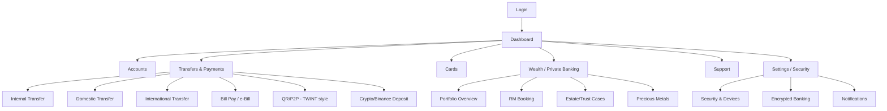

# Migros-Private Banking — UI/UX Design Document

**Companion to:** `ebanking-prd-trd.md`
**Version:** 1.0 (Draft)
**Date:** October 1, 2026

---

## 1. Design Philosophy
The interface should feel like a **premium Swiss private bank**, not a mass-market fintech app: calm, precise, trustworthy, understated. Design principles:
- **Clarity over decoration** — every screen answers "what's my money doing right now?" in one glance.
- **Restraint** — generous white space, minimal color accents, no gamified visual noise.
- **Precision** — numbers, alignment, and typography are treated with the same rigor as a printed bank statement.
- **Reassurance** — security and status (encrypted, verified, protected) are visually reinforced without being alarmist.

## 2. Design System

### 2.1 Color Palette
| Token | Usage | Example |
|---|---|---|
| `--color-primary` | Brand/action color (deep navy or Migros orange accent, TBD with brand team) | Primary buttons, active nav |
| `--color-surface` | Card/panel backgrounds | Light: white / Dark: near-black |
| `--color-background` | App background | Light: off-white / Dark: charcoal |
| `--color-text-primary` | Main text | High-contrast |
| `--color-text-secondary` | Supporting text, labels | Muted gray |
| `--color-success` | Credits, completed status | Green |
| `--color-danger` | Debits (optional), errors, blocked/frozen state | Red |
| `--color-warning` | Pending, review-required states | Amber |
| `--color-encrypted` | Encrypted Banking accent (distinct, e.g., deep violet) | Badges, Encrypted Banking screens |

Full light/dark theme tokens defined per `prefers-color-scheme`, consistent with the technical theming rules in the TRD.

### 2.2 Typography
- Primary typeface: a neutral, highly legible sans-serif (e.g., Inter, or a licensed Swiss grotesque such as a Helvetica-family font, subject to licensing).
- Numeric figures use **tabular figures** (fixed-width digits) everywhere money is shown, so columns of amounts align.
- Type scale: Display (32px) → H1 (24px) → H2 (20px) → Body (16px) → Caption (13px), 1.4–1.5 line height.

### 2.3 Spacing & Grid
- 8px base spacing unit; all margins/padding are multiples of 8.
- Mobile: single-column, 16px side margins.
- Web: 12-column responsive grid, max content width ~1200px, centered.

### 2.4 Core Components
- Buttons (primary, secondary, destructive, text-link), all with disabled/loading states.
- Input fields with inline validation (error state appears on blur, not on every keystroke).
- Account/balance cards (masked and unmasked states).
- Transaction list row (icon/merchant logo, name, category tag, amount, status pill).
- Status pills (pending/amber, completed/green, failed/red, on-hold/gray).
- Modal/bottom-sheet pattern for step-up MFA, confirmations.
- Empty states (no transactions yet, no cards, etc.) with a helpful next action.

## 3. Information Architecture

Bottom navigation (mobile, 5 items max): **Home, Payments, Cards, Wealth, More**. "More" houses Support, Settings, Security, and lower-frequency features (safe deposit box, referrals, dispute filing) to avoid nav clutter.

## 4. Key Screens & Wireframe Notes

### 4.1 Onboarding / Sign-Up
- **Progress indicator** at top (step X of Y) throughout the multi-step flow (PRD §6.1.A).
- Document capture screen: camera viewfinder with a document-shaped guide overlay; auto-capture on focus lock.
- Liveness screen: simple on-screen prompts (e.g., "look straight ahead"), no separate app switch.
- **Account type selection**: card-based picker (one card per product) with a short description, key feature bullets, and a "Compare" link; multi-select supported (checkbox state on cards) so a customer can open more than one product at once.
- **Initial deposit screen**: amount input with method tabs (Bank transfer / Card / Crypto), a visible "Skip — fund later" link, and a summary before confirmation.
- Final screen: confirmation + "what happens next" (e.g., "Your account will be ready in ~2 minutes" or "Under review — we'll notify you").

### 4.2 Login
- Minimal single screen: identifier field, biometric prompt appears automatically if enrolled (no extra tap needed after app open).
- Step-up MFA appears as a bottom sheet, not a full-page redirect, to keep context.

### 4.3 Dashboard (Home)
- Top: total net worth/balance summary (optionally collapsible/hideable for privacy in public places).
- Horizontally scrollable account cards (checking, savings, multi-currency sub-accounts, Encrypted Banking marked with its accent color/badge).
- Quick actions row: Transfer, Pay, Request, Cards.
- Recent transactions (last 5) with "See all" link.
- Insights snippet (e.g., "You spent 12% more on dining this month") if Budgeting is enabled.

### 4.4 Transfers
- Single entry screen with tabs/segmented control: **Own Accounts / Domestic / International / Crypto**.
- International transfer flow shows FX rate and total fees **before** the confirm step, never after.
- Beneficiary picker with recently-used and saved beneficiaries surfaced first.
- Confirmation screen always shows: amount, fees, exchange rate (if applicable), estimated arrival, and requires explicit step-up MFA confirmation.

### 4.5 Cards
- Card visual (masked number, brand) with quick toggles: Freeze, Set Limit, View PIN, Report Lost.
- Virtual card shown with a distinct "Virtual" badge until the physical card arrives.

### 4.6 Wealth / Private Banking
- Portfolio overview: holdings list + simple performance chart (line chart, minimal gridlines).
- RM contact card pinned at top ("Your Relationship Manager — [Name], Book a call").
- Case-based features (Estate Planning, Trust/Foundation, Philanthropy, Family Office) presented as a "My Requests" list with status tracking, not deeply nested menus.

### 4.7 Encrypted Banking
- Distinct visual treatment (accent color, lock iconography) to signal the elevated privacy tier without being alarming.
- Application screen is a short single form (face verification only, per FR-13n) with a clear explanation of what changes (masked names, stricter MFA, limits).

### 4.8 Admin / Back-Office Portal (separate design system, desktop-first)
- Data-dense, table-first layouts (unlike the consumer app's card-first layouts).
- Every edit action opens a side-panel/drawer requiring a justification note before submission (per FR-77).
- Maker-checker actions show a clear "Pending your approval" queue for checkers, distinct from the requester's own "Submitted" queue.
- Global search bar (customer, account, transaction ID) always visible in the top bar.

## 5. Key User Flows (Journey Maps)
1. **New customer opens an account** → download app → sign-up flow (§4.1) → funded account → first login.
2. **Existing customer sends an international transfer** → dashboard → Transfers → International tab → beneficiary → amount/currency → fee/rate review → MFA confirm → status tracking.
3. **Customer applies for Encrypted Banking** → Settings → Encrypted Banking → face verification → (instant or pending) → tier active, UI accent changes.
4. **Admin reverses a disputed transaction** → search transaction → open detail drawer → "Reverse" action → justification note → submitted to checker queue → checker approves → audit log entry created.

## 6. Accessibility (WCAG 2.1 AA)
- Minimum 4.5:1 text contrast; interactive elements minimum 3:1 against background.
- All icons paired with text labels or accessible `aria-label`s; no icon-only critical actions.
- Full flow operability via screen reader and keyboard/switch control.
- Minimum touch target size 44x44px on mobile.
- Motion/animation respects `prefers-reduced-motion`.

## 7. Platform-Specific Notes
- **Mobile (iOS/Android):** biometric prompts use native OS dialogs, not custom UI, for user trust and OS-level security guarantees.
- **Web:** responsive down to tablet width; a "download the app" nudge is shown (not forced) for features like camera-based document capture where mobile is better suited, with a web-based fallback upload option always available.
- **Admin portal:** desktop-only; not optimized for mobile, given its data-dense nature.

## 8. Next Steps for Design Handoff
- Produce high-fidelity mockups (Figma) for the screens listed in §4, per platform (iOS, Android, Web, Admin).
- Build a component library in code matching §2 tokens, shared across mobile and web where feasible (e.g., design tokens as a shared JSON/CSS-variable source).
- Usability testing on the onboarding flow specifically (highest drop-off risk point) before full build-out.
